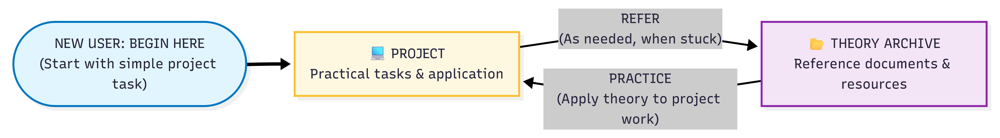
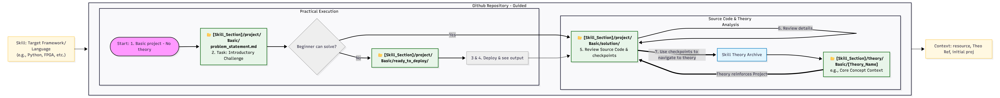

# ECIL Contract Employees Technical Resource Center

**Empowering Rapid Skill Acquisition through the Project-First Methodology**

Welcome to the central training repository for ECIL Contract Employees. This environment is specifically engineered to accelerate technical proficiency. By prioritizing execution over passive reading, this guide ensures a streamlined transition from theoretical concepts to industrial application.

---

## 1. Core Methodology: Project-First Learning

Traditional pedagogical models often prioritize exhaustive theory, which frequently leads to engagement attrition and a lack of practical context. This repository utilizes a reverse-engineered approach:

> **The Principle**: Proficiency is achieved by solving real-world problems. Theoretical documentation is utilized as a precision tool—accessed only when required to bridge a specific knowledge gap during implementation.

---

## 2. Operational Workflow

### High-Level Learning Loop
The process is cyclical. You initiate a project task, utilize the Theory Archive as a reference point when encountering blockers, and immediately reintegrate that knowledge into the live code.

*Note: The project serves as the primary driver; the Theory Archive serves as the support infrastructure.*

---

## 3. Repository Navigation and Architecture

The repository is logically partitioned by skill set (e.g., C Programming, Embedded Systems, Scripting). Within each skill section, the architecture is divided into two primary domains:

| Domain | Description | Content Type |
| :--- | :--- | :--- |
| **Project** | Practical implementation and challenges. | Problem statements, ready-to-deploy code, and solutions. |
| **Theory** | Foundational knowledge and reference material. | Technical documentation and skill-specific archives. |

### Detailed Learning Path
Follow the systematic workflow below to maximize training efficiency:

---

## 4. Execution Guide: Step-by-Step

### Step 01 | Initial Implementation
Navigate to the specific skill directory: `[skill_name]/project/Basic/`. Open the `problem_statement.md` and attempt the task immediately. This "blind" start identifies your baseline knowledge.

### Step 02 | Deployment and Observation
If the task cannot be completed initially, access the `ready_to_deploy/` directory. Execute the provided binaries or scripts to observe the expected system behavior and output.

### Step 03 | Source Code Analysis
Review the `solution/` directory. Analyze the source code thoroughly, paying close attention to the embedded **Checkpoints** (e.g., `// Skill Pointer: See Theory -> Malloc`). These are strategically placed to highlight critical concepts.

### Step 04 | Targeted Theoretical Research
Use the pointers found in the source code to navigate directly to the corresponding file in the `theory/Basic/` archive. Focus exclusively on the material required to understand the current solution.

### Step 05 | Knowledge Integration
Apply the newly acquired theoretical understanding back to the project. Modify, rebuild, and re-execute the code to verify that the concept is fully internalized.

---

**By adhering to this systematic loop, you develop practical engineering intuition validated by rigorous technical theory.**